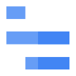

# GCP Symbols

| Category                                           | PUML Macro (Name)                              | Image (PNG)                                                                                                                                            | PUML Url                                                                                             |
|----------------------------------------------------|------------------------------------------------|--------------------------------------------------------------------------------------------------------------------------------------------------------|------------------------------------------------------------------------------------------------------|
| **access_context_manager**                         |                                                |                                                                                                                                                        |                                                                                                      |
| access_context_manager                             | (all macros)                                   | -                                                                                                                                                      | [all.puml](./access_context_manager/all.puml)                                                        |
| access_context_manager                             | access_context_manager                         |                                                                          | ./access_context_manager/access_context_manager.puml                                                 |
| **administration**                                 |                                                |                                                                                                                                                        |                                                                                                      |
| administration                                     | (all macros)                                   | -                                                                                                                                                      | [all.puml](./administration/all.puml)                                                                |
| administration                                     | administration                                 |                                                                                                  | ./administration/administration.puml                                                                 |
| **advanced_agent_modeling**                        |                                                |                                                                                                                                                        |                                                                                                      |
| advanced_agent_modeling                            | (all macros)                                   | -                                                                                                                                                      | [all.puml](./advanced_agent_modeling/all.puml)                                                       |
| advanced_agent_modeling                            | advanced_agent_modeling                        |                                                                       | ./advanced_agent_modeling/advanced_agent_modeling.puml                                               |
| **advanced_solutions_lab**                         |                                                |                                                                                                                                                        |                                                                                                      |
| advanced_solutions_lab                             | (all macros)                                   | -                                                                                                                                                      | [all.puml](./advanced_solutions_lab/all.puml)                                                        |
| advanced_solutions_lab                             | advanced_solutions_lab                         |                                                                          | ./advanced_solutions_lab/advanced_solutions_lab.puml                                                 |
| **agent_assist**                                   |                                                |                                                                                                                                                        |                                                                                                      |
| agent_assist                                       | (all macros)                                   | -                                                                                                                                                      | [all.puml](./agent_assist/all.puml)                                                                  |
| agent_assist                                       | agent_assist                                   |                                                                                                        | ./agent_assist/agent_assist.puml                                                                     |
| **ai_hub**                                         |                                                |                                                                                                                                                        |                                                                                                      |
| ai_hub                                             | (all macros)                                   | -                                                                                                                                                      | [all.puml](./ai_hub/all.puml)                                                                        |
| ai_hub                                             | ai_hub                                         |                                                                                                                          | ./ai_hub/ai_hub.puml                                                                                 |
| **ai_platform**                                    |                                                |                                                                                                                                                        |                                                                                                      |
| ai_platform                                        | (all macros)                                   | -                                                                                                                                                      | [all.puml](./ai_platform/all.puml)                                                                   |
| ai_platform                                        | ai_platform                                    |                                                                                                           | ./ai_platform/ai_platform.puml                                                                       |
| **ai_platform_unified**                            |                                                |                                                                                                                                                        |                                                                                                      |
| ai_platform_unified                                | (all macros)                                   | -                                                                                                                                                      | [all.puml](./ai_platform_unified/all.puml)                                                           |
| ai_platform_unified                                | ai_platform_unified                            |                                                                                   | ./ai_platform_unified/ai_platform_unified.puml                                                       |
| **analytics_hub**                                  |                                                |                                                                                                                                                        |                                                                                                      |
| analytics_hub                                      | (all macros)                                   | -                                                                                                                                                      | [all.puml](./analytics_hub/all.puml)                                                                 |
| analytics_hub                                      | analytics_hub                                  |                                                                                                     | ./analytics_hub/analytics_hub.puml                                                                   |
| **anthos**                                         |                                                |                                                                                                                                                        |                                                                                                      |
| anthos                                             | (all macros)                                   | -                                                                                                                                                      | [all.puml](./anthos/all.puml)                                                                        |
| anthos                                             | anthos                                         |                                                                                                                          | ./anthos/anthos.puml                                                                                 |
| **anthos_config_management**                       |                                                |                                                                                                                                                        |                                                                                                      |
| anthos_config_management                           | (all macros)                                   | -                                                                                                                                                      | [all.puml](./anthos_config_management/all.puml)                                                      |
| anthos_config_management                           | anthos_config_management                       |                                                                    | ./anthos_config_management/anthos_config_management.puml                                             |
| **anthos_service_mesh**                            |                                                |                                                                                                                                                        |                                                                                                      |
| anthos_service_mesh                                | (all macros)                                   | -                                                                                                                                                      | [all.puml](./anthos_service_mesh/all.puml)                                                           |
| anthos_service_mesh                                | anthos_service_mesh                            |                                                                                   | ./anthos_service_mesh/anthos_service_mesh.puml                                                       |
| **api**                                            |                                                |                                                                                                                                                        |                                                                                                      |
| api                                                | (all macros)                                   | -                                                                                                                                                      | [all.puml](./api/all.puml)                                                                           |
| api                                                | api                                            |                                                                                                                                   | ./api/api.puml                                                                                       |
| **api_analytics**                                  |                                                |                                                                                                                                                        |                                                                                                      |
| api_analytics                                      | (all macros)                                   | -                                                                                                                                                      | [all.puml](./api_analytics/all.puml)                                                                 |
| api_analytics                                      | api_analytics                                  |                                                                                                     | ./api_analytics/api_analytics.puml                                                                   |
| **api_monetization**                               |                                                |                                                                                                                                                        |                                                                                                      |
| api_monetization                                   | (all macros)                                   | -                                                                                                                                                      | [all.puml](./api_monetization/all.puml)                                                              |
| api_monetization                                   | api_monetization                               |                                                                                            | ./api_monetization/api_monetization.puml                                                             |
| **apigee_api_platform**                            |                                                |                                                                                                                                                        |                                                                                                      |
| apigee_api_platform                                | (all macros)                                   | -                                                                                                                                                      | [all.puml](./apigee_api_platform/all.puml)                                                           |
| apigee_api_platform                                | apigee_api_platform                            |                                                                                   | ./apigee_api_platform/apigee_api_platform.puml                                                       |
| **apigee_sense**                                   |                                                |                                                                                                                                                        |                                                                                                      |
| apigee_sense                                       | (all macros)                                   | -                                                                                                                                                      | [all.puml](./apigee_sense/all.puml)                                                                  |
| apigee_sense                                       | apigee_sense                                   |                                                                                                        | ./apigee_sense/apigee_sense.puml                                                                     |
| **app_engine**                                     |                                                |                                                                                                                                                        |                                                                                                      |
| app_engine                                         | (all macros)                                   | -                                                                                                                                                      | [all.puml](./app_engine/all.puml)                                                                    |
| app_engine                                         | app_engine                                     |                                                                                                              | ./app_engine/app_engine.puml                                                                         |
| **artifact_registry**                              |                                                |                                                                                                                                                        |                                                                                                      |
| artifact_registry                                  | (all macros)                                   | -                                                                                                                                                      | [all.puml](./artifact_registry/all.puml)                                                             |
| artifact_registry                                  | artifact_registry                              |                                                                                         | ./artifact_registry/artifact_registry.puml                                                           |
| **asset_inventory**                                |                                                |                                                                                                                                                        |                                                                                                      |
| asset_inventory                                    | (all macros)                                   | -                                                                                                                                                      | [all.puml](./asset_inventory/all.puml)                                                               |
| asset_inventory                                    | asset_inventory                                |                                                                                               | ./asset_inventory/asset_inventory.puml                                                               |
| **assured_workloads**                              |                                                |                                                                                                                                                        |                                                                                                      |
| assured_workloads                                  | (all macros)                                   | -                                                                                                                                                      | [all.puml](./assured_workloads/all.puml)                                                             |
| assured_workloads                                  | assured_workloads                              |                                                                                         | ./assured_workloads/assured_workloads.puml                                                           |
| **automl**                                         |                                                |                                                                                                                                                        |                                                                                                      |
| automl                                             | (all macros)                                   | -                                                                                                                                                      | [all.puml](./automl/all.puml)                                                                        |
| automl                                             | automl                                         |                                                                                                                          | ./automl/automl.puml                                                                                 |
| **automl_natural_language**                        |                                                |                                                                                                                                                        |                                                                                                      |
| automl_natural_language                            | (all macros)                                   | -                                                                                                                                                      | [all.puml](./automl_natural_language/all.puml)                                                       |
| automl_natural_language                            | automl_natural_language                        |                                                                       | ./automl_natural_language/automl_natural_language.puml                                               |
| **automl_tables**                                  |                                                |                                                                                                                                                        |                                                                                                      |
| automl_tables                                      | (all macros)                                   | -                                                                                                                                                      | [all.puml](./automl_tables/all.puml)                                                                 |
| automl_tables                                      | automl_tables                                  |                                                                                                     | ./automl_tables/automl_tables.puml                                                                   |
| **automl_translation**                             |                                                |                                                                                                                                                        |                                                                                                      |
| automl_translation                                 | (all macros)                                   | -                                                                                                                                                      | [all.puml](./automl_translation/all.puml)                                                            |
| automl_translation                                 | automl_translation                             |                                                                                      | ./automl_translation/automl_translation.puml                                                         |
| **automl_video_intelligence**                      |                                                |                                                                                                                                                        |                                                                                                      |
| automl_video_intelligence                          | (all macros)                                   | -                                                                                                                                                      | [all.puml](./automl_video_intelligence/all.puml)                                                     |
| automl_video_intelligence                          | automl_video_intelligence                      |                                                                 | ./automl_video_intelligence/automl_video_intelligence.puml                                           |
| **automl_vision**                                  |                                                |                                                                                                                                                        |                                                                                                      |
| automl_vision                                      | (all macros)                                   | -                                                                                                                                                      | [all.puml](./automl_vision/all.puml)                                                                 |
| automl_vision                                      | automl_vision                                  |                                                                                                     | ./automl_vision/automl_vision.puml                                                                   |
| **bare_metal_solutions**                           |                                                |                                                                                                                                                        |                                                                                                      |
| bare_metal_solutions                               | (all macros)                                   | -                                                                                                                                                      | [all.puml](./bare_metal_solutions/all.puml)                                                          |
| bare_metal_solutions                               | bare_metal_solutions                           |                                                                                | ./bare_metal_solutions/bare_metal_solutions.puml                                                     |
| **batch**                                          |                                                |                                                                                                                                                        |                                                                                                      |
| batch                                              | (all macros)                                   | -                                                                                                                                                      | [all.puml](./batch/all.puml)                                                                         |
| batch                                              | batch                                          |                                                                                                                             | ./batch/batch.puml                                                                                   |
| **beyondcorp**                                     |                                                |                                                                                                                                                        |                                                                                                      |
| beyondcorp                                         | (all macros)                                   | -                                                                                                                                                      | [all.puml](./beyondcorp/all.puml)                                                                    |
| beyondcorp                                         | beyondcorp                                     |                                                                                                              | ./beyondcorp/beyondcorp.puml                                                                         |
| **bigquery**                                       |                                                |                                                                                                                                                        |                                                                                                      |
| bigquery                                           | (all macros)                                   | -                                                                                                                                                      | [all.puml](./bigquery/all.puml)                                                                      |
| bigquery                                           | bigquery                                       |                                                                                                                    | ./bigquery/bigquery.puml                                                                             |
| **bigtable**                                       |                                                |                                                                                                                                                        |                                                                                                      |
| bigtable                                           | (all macros)                                   | -                                                                                                                                                      | [all.puml](./bigtable/all.puml)                                                                      |
| bigtable                                           | bigtable                                       |                                                                                                                    | ./bigtable/bigtable.puml                                                                             |
| **billing**                                        |                                                |                                                                                                                                                        |                                                                                                      |
| billing                                            | (all macros)                                   | -                                                                                                                                                      | [all.puml](./billing/all.puml)                                                                       |
| billing                                            | billing                                        |                                                                                                                       | ./billing/billing.puml                                                                               |
| **binary_authorization**                           |                                                |                                                                                                                                                        |                                                                                                      |
| binary_authorization                               | (all macros)                                   | -                                                                                                                                                      | [all.puml](./binary_authorization/all.puml)                                                          |
| binary_authorization                               | binary_authorization                           |                                                                                | ./binary_authorization/binary_authorization.puml                                                     |
| **catalog**                                        |                                                |                                                                                                                                                        |                                                                                                      |
| catalog                                            | (all macros)                                   | -                                                                                                                                                      | [all.puml](./catalog/all.puml)                                                                       |
| catalog                                            | catalog                                        |                                                                                                                       | ./catalog/catalog.puml                                                                               |
| **certificate_authority_service**                  |                                                |                                                                                                                                                        |                                                                                                      |
| certificate_authority_service                      | (all macros)                                   | -                                                                                                                                                      | [all.puml](./certificate_authority_service/all.puml)                                                 |
| certificate_authority_service                      | certificate_authority_service                  |                                                     | ./certificate_authority_service/certificate_authority_service.puml                                   |
| **certificate_manager**                            |                                                |                                                                                                                                                        |                                                                                                      |
| certificate_manager                                | (all macros)                                   | -                                                                                                                                                      | [all.puml](./certificate_manager/all.puml)                                                           |
| certificate_manager                                | certificate_manager                            |                                                                                   | ./certificate_manager/certificate_manager.puml                                                       |
| **cloud_api_gateway**                              |                                                |                                                                                                                                                        |                                                                                                      |
| cloud_api_gateway                                  | (all macros)                                   | -                                                                                                                                                      | [all.puml](./cloud_api_gateway/all.puml)                                                             |
| cloud_api_gateway                                  | cloud_api_gateway                              |                                                                                         | ./cloud_api_gateway/cloud_api_gateway.puml                                                           |
| **cloud_apis**                                     |                                                |                                                                                                                                                        |                                                                                                      |
| cloud_apis                                         | (all macros)                                   | -                                                                                                                                                      | [all.puml](./cloud_apis/all.puml)                                                                    |
| cloud_apis                                         | cloud_apis                                     |                                                                                                              | ./cloud_apis/cloud_apis.puml                                                                         |
| **cloud_armor**                                    |                                                |                                                                                                                                                        |                                                                                                      |
| cloud_armor                                        | (all macros)                                   | -                                                                                                                                                      | [all.puml](./cloud_armor/all.puml)                                                                   |
| cloud_armor                                        | cloud_armor                                    |                                                                                                           | ./cloud_armor/cloud_armor.puml                                                                       |
| **cloud_asset_inventory**                          |                                                |                                                                                                                                                        |                                                                                                      |
| cloud_asset_inventory                              | (all macros)                                   | -                                                                                                                                                      | [all.puml](./cloud_asset_inventory/all.puml)                                                         |
| cloud_asset_inventory                              | cloud_asset_inventory                          |                                                                             | ./cloud_asset_inventory/cloud_asset_inventory.puml                                                   |
| **cloud_audit_logs**                               |                                                |                                                                                                                                                        |                                                                                                      |
| cloud_audit_logs                                   | (all macros)                                   | -                                                                                                                                                      | [all.puml](./cloud_audit_logs/all.puml)                                                              |
| cloud_audit_logs                                   | cloud_audit_logs                               |                                                                                            | ./cloud_audit_logs/cloud_audit_logs.puml                                                             |
| **cloud_build**                                    |                                                |                                                                                                                                                        |                                                                                                      |
| cloud_build                                        | (all macros)                                   | -                                                                                                                                                      | [all.puml](./cloud_build/all.puml)                                                                   |
| cloud_build                                        | cloud_build                                    |                                                                                                           | ./cloud_build/cloud_build.puml                                                                       |
| **cloud_cdn**                                      |                                                |                                                                                                                                                        |                                                                                                      |
| cloud_cdn                                          | (all macros)                                   | -                                                                                                                                                      | [all.puml](./cloud_cdn/all.puml)                                                                     |
| cloud_cdn                                          | cloud_cdn                                      |                                                                                                                 | ./cloud_cdn/cloud_cdn.puml                                                                           |
| **cloud_code**                                     |                                                |                                                                                                                                                        |                                                                                                      |
| cloud_code                                         | (all macros)                                   | -                                                                                                                                                      | [all.puml](./cloud_code/all.puml)                                                                    |
| cloud_code                                         | cloud_code                                     |                                                                                                              | ./cloud_code/cloud_code.puml                                                                         |
| **cloud_composer**                                 |                                                |                                                                                                                                                        |                                                                                                      |
| cloud_composer                                     | (all macros)                                   | -                                                                                                                                                      | [all.puml](./cloud_composer/all.puml)                                                                |
| cloud_composer                                     | cloud_composer                                 |                                                                                                  | ./cloud_composer/cloud_composer.puml                                                                 |
| **cloud_data_fusion**                              |                                                |                                                                                                                                                        |                                                                                                      |
| cloud_data_fusion                                  | (all macros)                                   | -                                                                                                                                                      | [all.puml](./cloud_data_fusion/all.puml)                                                             |
| cloud_data_fusion                                  | cloud_data_fusion                              |                                                                                         | ./cloud_data_fusion/cloud_data_fusion.puml                                                           |
| **cloud_deploy**                                   |                                                |                                                                                                                                                        |                                                                                                      |
| cloud_deploy                                       | (all macros)                                   | -                                                                                                                                                      | [all.puml](./cloud_deploy/all.puml)                                                                  |
| cloud_deploy                                       | cloud_deploy                                   |                                                                                                        | ./cloud_deploy/cloud_deploy.puml                                                                     |
| **cloud_deployment_manager**                       |                                                |                                                                                                                                                        |                                                                                                      |
| cloud_deployment_manager                           | (all macros)                                   | -                                                                                                                                                      | [all.puml](./cloud_deployment_manager/all.puml)                                                      |
| cloud_deployment_manager                           | cloud_deployment_manager                       |                                                                    | ./cloud_deployment_manager/cloud_deployment_manager.puml                                             |
| **cloud_dns**                                      |                                                |                                                                                                                                                        |                                                                                                      |
| cloud_dns                                          | (all macros)                                   | -                                                                                                                                                      | [all.puml](./cloud_dns/all.puml)                                                                     |
| cloud_dns                                          | cloud_dns                                      |                                                                                                                 | ./cloud_dns/cloud_dns.puml                                                                           |
| **cloud_domains**                                  |                                                |                                                                                                                                                        |                                                                                                      |
| cloud_domains                                      | (all macros)                                   | -                                                                                                                                                      | [all.puml](./cloud_domains/all.puml)                                                                 |
| cloud_domains                                      | cloud_domains                                  |                                                                                                     | ./cloud_domains/cloud_domains.puml                                                                   |
| **cloud_ekm**                                      |                                                |                                                                                                                                                        |                                                                                                      |
| cloud_ekm                                          | (all macros)                                   | -                                                                                                                                                      | [all.puml](./cloud_ekm/all.puml)                                                                     |
| cloud_ekm                                          | cloud_ekm                                      |                                                                                                                 | ./cloud_ekm/cloud_ekm.puml                                                                           |
| **cloud_endpoints**                                |                                                |                                                                                                                                                        |                                                                                                      |
| cloud_endpoints                                    | (all macros)                                   | -                                                                                                                                                      | [all.puml](./cloud_endpoints/all.puml)                                                               |
| cloud_endpoints                                    | cloud_endpoints                                |                                                                                               | ./cloud_endpoints/cloud_endpoints.puml                                                               |
| **cloud_external_ip_addresses**                    |                                                |                                                                                                                                                        |                                                                                                      |
| cloud_external_ip_addresses                        | (all macros)                                   | -                                                                                                                                                      | [all.puml](./cloud_external_ip_addresses/all.puml)                                                   |
| cloud_external_ip_addresses                        | cloud_external_ip_addresses                    |                                                           | ./cloud_external_ip_addresses/cloud_external_ip_addresses.puml                                       |
| **cloud_firewall_rules**                           |                                                |                                                                                                                                                        |                                                                                                      |
| cloud_firewall_rules                               | (all macros)                                   | -                                                                                                                                                      | [all.puml](./cloud_firewall_rules/all.puml)                                                          |
| cloud_firewall_rules                               | cloud_firewall_rules                           |                                                                                | ./cloud_firewall_rules/cloud_firewall_rules.puml                                                     |
| **cloud_for_marketing**                            |                                                |                                                                                                                                                        |                                                                                                      |
| cloud_for_marketing                                | (all macros)                                   | -                                                                                                                                                      | [all.puml](./cloud_for_marketing/all.puml)                                                           |
| cloud_for_marketing                                | cloud_for_marketing                            |                                                                                   | ./cloud_for_marketing/cloud_for_marketing.puml                                                       |
| **cloud_functions**                                |                                                |                                                                                                                                                        |                                                                                                      |
| cloud_functions                                    | (all macros)                                   | -                                                                                                                                                      | [all.puml](./cloud_functions/all.puml)                                                               |
| cloud_functions                                    | cloud_functions                                |                                                                                               | ./cloud_functions/cloud_functions.puml                                                               |
| **cloud_generic**                                  |                                                |                                                                                                                                                        |                                                                                                      |
| cloud_generic                                      | (all macros)                                   | -                                                                                                                                                      | [all.puml](./cloud_generic/all.puml)                                                                 |
| cloud_generic                                      | cloud_generic                                  |                                                                                                     | ./cloud_generic/cloud_generic.puml                                                                   |
| **cloud_gpu**                                      |                                                |                                                                                                                                                        |                                                                                                      |
| cloud_gpu                                          | (all macros)                                   | -                                                                                                                                                      | [all.puml](./cloud_gpu/all.puml)                                                                     |
| cloud_gpu                                          | cloud_gpu                                      |                                                                                                                 | ./cloud_gpu/cloud_gpu.puml                                                                           |
| **cloud_healthcare_api**                           |                                                |                                                                                                                                                        |                                                                                                      |
| cloud_healthcare_api                               | (all macros)                                   | -                                                                                                                                                      | [all.puml](./cloud_healthcare_api/all.puml)                                                          |
| cloud_healthcare_api                               | cloud_healthcare_api                           |                                                                                | ./cloud_healthcare_api/cloud_healthcare_api.puml                                                     |
| **cloud_healthcare_marketplace**                   |                                                |                                                                                                                                                        |                                                                                                      |
| cloud_healthcare_marketplace                       | (all macros)                                   | -                                                                                                                                                      | [all.puml](./cloud_healthcare_marketplace/all.puml)                                                  |
| cloud_healthcare_marketplace                       | cloud_healthcare_marketplace                   |                                                        | ./cloud_healthcare_marketplace/cloud_healthcare_marketplace.puml                                     |
| **cloud_hsm**                                      |                                                |                                                                                                                                                        |                                                                                                      |
| cloud_hsm                                          | (all macros)                                   | -                                                                                                                                                      | [all.puml](./cloud_hsm/all.puml)                                                                     |
| cloud_hsm                                          | cloud_hsm                                      |                                                                                                                 | ./cloud_hsm/cloud_hsm.puml                                                                           |
| **cloud_ids**                                      |                                                |                                                                                                                                                        |                                                                                                      |
| cloud_ids                                          | (all macros)                                   | -                                                                                                                                                      | [all.puml](./cloud_ids/all.puml)                                                                     |
| cloud_ids                                          | cloud_ids                                      |                                                                                                                 | ./cloud_ids/cloud_ids.puml                                                                           |
| **cloud_inference_api**                            |                                                |                                                                                                                                                        |                                                                                                      |
| cloud_inference_api                                | (all macros)                                   | -                                                                                                                                                      | [all.puml](./cloud_inference_api/all.puml)                                                           |
| cloud_inference_api                                | cloud_inference_api                            |                                                                                   | ./cloud_inference_api/cloud_inference_api.puml                                                       |
| **cloud_interconnect**                             |                                                |                                                                                                                                                        |                                                                                                      |
| cloud_interconnect                                 | (all macros)                                   | -                                                                                                                                                      | [all.puml](./cloud_interconnect/all.puml)                                                            |
| cloud_interconnect                                 | cloud_interconnect                             |                                                                                      | ./cloud_interconnect/cloud_interconnect.puml                                                         |
| **cloud_jobs_api**                                 |                                                |                                                                                                                                                        |                                                                                                      |
| cloud_jobs_api                                     | (all macros)                                   | -                                                                                                                                                      | [all.puml](./cloud_jobs_api/all.puml)                                                                |
| cloud_jobs_api                                     | cloud_jobs_api                                 |                                                                                                  | ./cloud_jobs_api/cloud_jobs_api.puml                                                                 |
| **cloud_load_balancing**                           |                                                |                                                                                                                                                        |                                                                                                      |
| cloud_load_balancing                               | (all macros)                                   | -                                                                                                                                                      | [all.puml](./cloud_load_balancing/all.puml)                                                          |
| cloud_load_balancing                               | cloud_load_balancing                           |                                                                                | ./cloud_load_balancing/cloud_load_balancing.puml                                                     |
| **cloud_logging**                                  |                                                |                                                                                                                                                        |                                                                                                      |
| cloud_logging                                      | (all macros)                                   | -                                                                                                                                                      | [all.puml](./cloud_logging/all.puml)                                                                 |
| cloud_logging                                      | cloud_logging                                  |                                                                                                     | ./cloud_logging/cloud_logging.puml                                                                   |
| **cloud_media_edge**                               |                                                |                                                                                                                                                        |                                                                                                      |
| cloud_media_edge                                   | (all macros)                                   | -                                                                                                                                                      | [all.puml](./cloud_media_edge/all.puml)                                                              |
| cloud_media_edge                                   | cloud_media_edge                               |                                                                                            | ./cloud_media_edge/cloud_media_edge.puml                                                             |
| **cloud_monitoring**                               |                                                |                                                                                                                                                        |                                                                                                      |
| cloud_monitoring                                   | (all macros)                                   | -                                                                                                                                                      | [all.puml](./cloud_monitoring/all.puml)                                                              |
| cloud_monitoring                                   | cloud_monitoring                               |                                                                                            | ./cloud_monitoring/cloud_monitoring.puml                                                             |
| **cloud_nat**                                      |                                                |                                                                                                                                                        |                                                                                                      |
| cloud_nat                                          | (all macros)                                   | -                                                                                                                                                      | [all.puml](./cloud_nat/all.puml)                                                                     |
| cloud_nat                                          | cloud_nat                                      |                                                                                                                 | ./cloud_nat/cloud_nat.puml                                                                           |
| **cloud_natural_language_api**                     |                                                |                                                                                                                                                        |                                                                                                      |
| cloud_natural_language_api                         | (all macros)                                   | -                                                                                                                                                      | [all.puml](./cloud_natural_language_api/all.puml)                                                    |
| cloud_natural_language_api                         | cloud_natural_language_api                     |                                                              | ./cloud_natural_language_api/cloud_natural_language_api.puml                                         |
| **cloud_network**                                  |                                                |                                                                                                                                                        |                                                                                                      |
| cloud_network                                      | (all macros)                                   | -                                                                                                                                                      | [all.puml](./cloud_network/all.puml)                                                                 |
| cloud_network                                      | cloud_network                                  |                                                                                                     | ./cloud_network/cloud_network.puml                                                                   |
| **cloud_ops**                                      |                                                |                                                                                                                                                        |                                                                                                      |
| cloud_ops                                          | (all macros)                                   | -                                                                                                                                                      | [all.puml](./cloud_ops/all.puml)                                                                     |
| cloud_ops                                          | cloud_ops                                      |                                                                                                                 | ./cloud_ops/cloud_ops.puml                                                                           |
| **cloud_optimization_ai**                          |                                                |                                                                                                                                                        |                                                                                                      |
| cloud_optimization_ai                              | (all macros)                                   | -                                                                                                                                                      | [all.puml](./cloud_optimization_ai/all.puml)                                                         |
| cloud_optimization_ai                              | cloud_optimization_ai                          |                                                                             | ./cloud_optimization_ai/cloud_optimization_ai.puml                                                   |
| **cloud_optimization_ai_-_fleet_routing_api**      |                                                |                                                                                                                                                        |                                                                                                      |
| cloud_optimization_ai_-_fleet_routing_api          | (all macros)                                   | -                                                                                                                                                      | [all.puml](./cloud_optimization_ai_-_fleet_routing_api/all.puml)                                     |
| cloud_optimization_ai_-_fleet_routing_api          | cloud_optimization_ai___fleet_routing_api      |                 | ./cloud_optimization_ai_-_fleet_routing_api/cloud_optimization_ai___fleet_routing_api.puml           |
| **cloud_router**                                   |                                                |                                                                                                                                                        |                                                                                                      |
| cloud_router                                       | (all macros)                                   | -                                                                                                                                                      | [all.puml](./cloud_router/all.puml)                                                                  |
| cloud_router                                       | cloud_router                                   |                                                                                                        | ./cloud_router/cloud_router.puml                                                                     |
| **cloud_routes**                                   |                                                |                                                                                                                                                        |                                                                                                      |
| cloud_routes                                       | (all macros)                                   | -                                                                                                                                                      | [all.puml](./cloud_routes/all.puml)                                                                  |
| cloud_routes                                       | cloud_routes                                   |                                                                                                        | ./cloud_routes/cloud_routes.puml                                                                     |
| **cloud_run**                                      |                                                |                                                                                                                                                        |                                                                                                      |
| cloud_run                                          | (all macros)                                   | -                                                                                                                                                      | [all.puml](./cloud_run/all.puml)                                                                     |
| cloud_run                                          | cloud_run                                      |                                                                                                                 | ./cloud_run/cloud_run.puml                                                                           |
| **cloud_run_for_anthos**                           |                                                |                                                                                                                                                        |                                                                                                      |
| cloud_run_for_anthos                               | (all macros)                                   | -                                                                                                                                                      | [all.puml](./cloud_run_for_anthos/all.puml)                                                          |
| cloud_run_for_anthos                               | cloud_run_for_anthos                           |                                                                                | ./cloud_run_for_anthos/cloud_run_for_anthos.puml                                                     |
| **cloud_scheduler**                                |                                                |                                                                                                                                                        |                                                                                                      |
| cloud_scheduler                                    | (all macros)                                   | -                                                                                                                                                      | [all.puml](./cloud_scheduler/all.puml)                                                               |
| cloud_scheduler                                    | cloud_scheduler                                |                                                                                               | ./cloud_scheduler/cloud_scheduler.puml                                                               |
| **cloud_security_scanner**                         |                                                |                                                                                                                                                        |                                                                                                      |
| cloud_security_scanner                             | (all macros)                                   | -                                                                                                                                                      | [all.puml](./cloud_security_scanner/all.puml)                                                        |
| cloud_security_scanner                             | cloud_security_scanner                         |                                                                          | ./cloud_security_scanner/cloud_security_scanner.puml                                                 |
| **cloud_shell**                                    |                                                |                                                                                                                                                        |                                                                                                      |
| cloud_shell                                        | (all macros)                                   | -                                                                                                                                                      | [all.puml](./cloud_shell/all.puml)                                                                   |
| cloud_shell                                        | cloud_shell                                    |                                                                                                           | ./cloud_shell/cloud_shell.puml                                                                       |
| **cloud_spanner**                                  |                                                |                                                                                                                                                        |                                                                                                      |
| cloud_spanner                                      | (all macros)                                   | -                                                                                                                                                      | [all.puml](./cloud_spanner/all.puml)                                                                 |
| cloud_spanner                                      | cloud_spanner                                  |                                                                                                     | ./cloud_spanner/cloud_spanner.puml                                                                   |
| **cloud_sql**                                      |                                                |                                                                                                                                                        |                                                                                                      |
| cloud_sql                                          | (all macros)                                   | -                                                                                                                                                      | [all.puml](./cloud_sql/all.puml)                                                                     |
| cloud_sql                                          | cloud_sql                                      |                                                                                                                 | ./cloud_sql/cloud_sql.puml                                                                           |
| **cloud_storage**                                  |                                                |                                                                                                                                                        |                                                                                                      |
| cloud_storage                                      | (all macros)                                   | -                                                                                                                                                      | [all.puml](./cloud_storage/all.puml)                                                                 |
| cloud_storage                                      | cloud_storage                                  |                                                                                                     | ./cloud_storage/cloud_storage.puml                                                                   |
| **cloud_tasks**                                    |                                                |                                                                                                                                                        |                                                                                                      |
| cloud_tasks                                        | (all macros)                                   | -                                                                                                                                                      | [all.puml](./cloud_tasks/all.puml)                                                                   |
| cloud_tasks                                        | cloud_tasks                                    |                                                                                                           | ./cloud_tasks/cloud_tasks.puml                                                                       |
| **cloud_test_lab**                                 |                                                |                                                                                                                                                        |                                                                                                      |
| cloud_test_lab                                     | (all macros)                                   | -                                                                                                                                                      | [all.puml](./cloud_test_lab/all.puml)                                                                |
| cloud_test_lab                                     | cloud_test_lab                                 |                                                                                                  | ./cloud_test_lab/cloud_test_lab.puml                                                                 |
| **cloud_tpu**                                      |                                                |                                                                                                                                                        |                                                                                                      |
| cloud_tpu                                          | (all macros)                                   | -                                                                                                                                                      | [all.puml](./cloud_tpu/all.puml)                                                                     |
| cloud_tpu                                          | cloud_tpu                                      |                                                                                                                 | ./cloud_tpu/cloud_tpu.puml                                                                           |
| **cloud_translation_api**                          |                                                |                                                                                                                                                        |                                                                                                      |
| cloud_translation_api                              | (all macros)                                   | -                                                                                                                                                      | [all.puml](./cloud_translation_api/all.puml)                                                         |
| cloud_translation_api                              | cloud_translation_api                          |                                                                             | ./cloud_translation_api/cloud_translation_api.puml                                                   |
| **cloud_vision_api**                               |                                                |                                                                                                                                                        |                                                                                                      |
| cloud_vision_api                                   | (all macros)                                   | -                                                                                                                                                      | [all.puml](./cloud_vision_api/all.puml)                                                              |
| cloud_vision_api                                   | cloud_vision_api                               |                                                                                            | ./cloud_vision_api/cloud_vision_api.puml                                                             |
| **cloud_vpn**                                      |                                                |                                                                                                                                                        |                                                                                                      |
| cloud_vpn                                          | (all macros)                                   | -                                                                                                                                                      | [all.puml](./cloud_vpn/all.puml)                                                                     |
| cloud_vpn                                          | cloud_vpn                                      |                                                                                                                 | ./cloud_vpn/cloud_vpn.puml                                                                           |
| **compute_engine**                                 |                                                |                                                                                                                                                        |                                                                                                      |
| compute_engine                                     | (all macros)                                   | -                                                                                                                                                      | [all.puml](./compute_engine/all.puml)                                                                |
| compute_engine                                     | compute_engine                                 |                                                                                                  | ./compute_engine/compute_engine.puml                                                                 |
| **configuration_management**                       |                                                |                                                                                                                                                        |                                                                                                      |
| configuration_management                           | (all macros)                                   | -                                                                                                                                                      | [all.puml](./configuration_management/all.puml)                                                      |
| configuration_management                           | configuration_management                       |                                                                    | ./configuration_management/configuration_management.puml                                             |
| **connectivity_test**                              |                                                |                                                                                                                                                        |                                                                                                      |
| connectivity_test                                  | (all macros)                                   | -                                                                                                                                                      | [all.puml](./connectivity_test/all.puml)                                                             |
| connectivity_test                                  | connectivity_test                              |                                                                                         | ./connectivity_test/connectivity_test.puml                                                           |
| **connectors**                                     |                                                |                                                                                                                                                        |                                                                                                      |
| connectors                                         | (all macros)                                   | -                                                                                                                                                      | [all.puml](./connectors/all.puml)                                                                    |
| connectors                                         | connectors                                     |                                                                                                              | ./connectors/connectors.puml                                                                         |
| **contact_center_ai**                              |                                                |                                                                                                                                                        |                                                                                                      |
| contact_center_ai                                  | (all macros)                                   | -                                                                                                                                                      | [all.puml](./contact_center_ai/all.puml)                                                             |
| contact_center_ai                                  | contact_center_ai                              |                                                                                         | ./contact_center_ai/contact_center_ai.puml                                                           |
| **container_optimized_os**                         |                                                |                                                                                                                                                        |                                                                                                      |
| container_optimized_os                             | (all macros)                                   | -                                                                                                                                                      | [all.puml](./container_optimized_os/all.puml)                                                        |
| container_optimized_os                             | container_optimized_os                         |                                                                          | ./container_optimized_os/container_optimized_os.puml                                                 |
| **container_registry**                             |                                                |                                                                                                                                                        |                                                                                                      |
| container_registry                                 | (all macros)                                   | -                                                                                                                                                      | [all.puml](./container_registry/all.puml)                                                            |
| container_registry                                 | container_registry                             |                                                                                      | ./container_registry/container_registry.puml                                                         |
| **data_catalog**                                   |                                                |                                                                                                                                                        |                                                                                                      |
| data_catalog                                       | (all macros)                                   | -                                                                                                                                                      | [all.puml](./data_catalog/all.puml)                                                                  |
| data_catalog                                       | data_catalog                                   |                                                                                                        | ./data_catalog/data_catalog.puml                                                                     |
| **data_labeling**                                  |                                                |                                                                                                                                                        |                                                                                                      |
| data_labeling                                      | (all macros)                                   | -                                                                                                                                                      | [all.puml](./data_labeling/all.puml)                                                                 |
| data_labeling                                      | data_labeling                                  |                                                                                                     | ./data_labeling/data_labeling.puml                                                                   |
| **data_layers**                                    |                                                |                                                                                                                                                        |                                                                                                      |
| data_layers                                        | (all macros)                                   | -                                                                                                                                                      | [all.puml](./data_layers/all.puml)                                                                   |
| data_layers                                        | data_layers                                    |                                                                                                           | ./data_layers/data_layers.puml                                                                       |
| **data_loss_prevention_api**                       |                                                |                                                                                                                                                        |                                                                                                      |
| data_loss_prevention_api                           | (all macros)                                   | -                                                                                                                                                      | [all.puml](./data_loss_prevention_api/all.puml)                                                      |
| data_loss_prevention_api                           | data_loss_prevention_api                       |                                                                    | ./data_loss_prevention_api/data_loss_prevention_api.puml                                             |
| **data_qna**                                       |                                                |                                                                                                                                                        |                                                                                                      |
| data_qna                                           | (all macros)                                   | -                                                                                                                                                      | [all.puml](./data_qna/all.puml)                                                                      |
| data_qna                                           | data_qna                                       |                                                                                                                    | ./data_qna/data_qna.puml                                                                             |
| **data_studio**                                    |                                                |                                                                                                                                                        |                                                                                                      |
| data_studio                                        | (all macros)                                   | -                                                                                                                                                      | [all.puml](./data_studio/all.puml)                                                                   |
| data_studio                                        | data_studio                                    |                                                                                                           | ./data_studio/data_studio.puml                                                                       |
| **data_transfer**                                  |                                                |                                                                                                                                                        |                                                                                                      |
| data_transfer                                      | (all macros)                                   | -                                                                                                                                                      | [all.puml](./data_transfer/all.puml)                                                                 |
| data_transfer                                      | data_transfer                                  |                                                                                                     | ./data_transfer/data_transfer.puml                                                                   |
| **database_migration_service**                     |                                                |                                                                                                                                                        |                                                                                                      |
| database_migration_service                         | (all macros)                                   | -                                                                                                                                                      | [all.puml](./database_migration_service/all.puml)                                                    |
| database_migration_service                         | database_migration_service                     |                                                              | ./database_migration_service/database_migration_service.puml                                         |
| **dataflow**                                       |                                                |                                                                                                                                                        |                                                                                                      |
| dataflow                                           | (all macros)                                   | -                                                                                                                                                      | [all.puml](./dataflow/all.puml)                                                                      |
| dataflow                                           | dataflow                                       |                                                                                                                    | ./dataflow/dataflow.puml                                                                             |
| **datalab**                                        |                                                |                                                                                                                                                        |                                                                                                      |
| datalab                                            | (all macros)                                   | -                                                                                                                                                      | [all.puml](./datalab/all.puml)                                                                       |
| datalab                                            | datalab                                        |                                                                                                                       | ./datalab/datalab.puml                                                                               |
| **dataplex**                                       |                                                |                                                                                                                                                        |                                                                                                      |
| dataplex                                           | (all macros)                                   | -                                                                                                                                                      | [all.puml](./dataplex/all.puml)                                                                      |
| dataplex                                           | dataplex                                       |                                                                                                                    | ./dataplex/dataplex.puml                                                                             |
| **datapol**                                        |                                                |                                                                                                                                                        |                                                                                                      |
| datapol                                            | (all macros)                                   | -                                                                                                                                                      | [all.puml](./datapol/all.puml)                                                                       |
| datapol                                            | datapol                                        |                                                                                                                       | ./datapol/datapol.puml                                                                               |
| **dataprep**                                       |                                                |                                                                                                                                                        |                                                                                                      |
| dataprep                                           | (all macros)                                   | -                                                                                                                                                      | [all.puml](./dataprep/all.puml)                                                                      |
| dataprep                                           | dataprep                                       |                                                                                                                    | ./dataprep/dataprep.puml                                                                             |
| **dataproc**                                       |                                                |                                                                                                                                                        |                                                                                                      |
| dataproc                                           | (all macros)                                   | -                                                                                                                                                      | [all.puml](./dataproc/all.puml)                                                                      |
| dataproc                                           | dataproc                                       |                                                                                                                    | ./dataproc/dataproc.puml                                                                             |
| **dataproc_metastore**                             |                                                |                                                                                                                                                        |                                                                                                      |
| dataproc_metastore                                 | (all macros)                                   | -                                                                                                                                                      | [all.puml](./dataproc_metastore/all.puml)                                                            |
| dataproc_metastore                                 | dataproc_metastore                             |                                                                                      | ./dataproc_metastore/dataproc_metastore.puml                                                         |
| **datashare**                                      |                                                |                                                                                                                                                        |                                                                                                      |
| datashare                                          | (all macros)                                   | -                                                                                                                                                      | [all.puml](./datashare/all.puml)                                                                     |
| datashare                                          | datashare                                      |                                                                                                                 | ./datashare/datashare.puml                                                                           |
| **datastore**                                      |                                                |                                                                                                                                                        |                                                                                                      |
| datastore                                          | (all macros)                                   | -                                                                                                                                                      | [all.puml](./datastore/all.puml)                                                                     |
| datastore                                          | datastore                                      |                                                                                                                 | ./datastore/datastore.puml                                                                           |
| **datastream**                                     |                                                |                                                                                                                                                        |                                                                                                      |
| datastream                                         | (all macros)                                   | -                                                                                                                                                      | [all.puml](./datastream/all.puml)                                                                    |
| datastream                                         | datastream                                     |                                                                                                              | ./datastream/datastream.puml                                                                         |
| **debugger**                                       |                                                |                                                                                                                                                        |                                                                                                      |
| debugger                                           | (all macros)                                   | -                                                                                                                                                      | [all.puml](./debugger/all.puml)                                                                      |
| debugger                                           | debugger                                       |                                                                                                                    | ./debugger/debugger.puml                                                                             |
| **developer_portal**                               |                                                |                                                                                                                                                        |                                                                                                      |
| developer_portal                                   | (all macros)                                   | -                                                                                                                                                      | [all.puml](./developer_portal/all.puml)                                                              |
| developer_portal                                   | developer_portal                               |                                                                                            | ./developer_portal/developer_portal.puml                                                             |
| **dialogflow**                                     |                                                |                                                                                                                                                        |                                                                                                      |
| dialogflow                                         | (all macros)                                   | -                                                                                                                                                      | [all.puml](./dialogflow/all.puml)                                                                    |
| dialogflow                                         | dialogflow                                     |                                                                                                              | ./dialogflow/dialogflow.puml                                                                         |
| **dialogflow_cx**                                  |                                                |                                                                                                                                                        |                                                                                                      |
| dialogflow_cx                                      | (all macros)                                   | -                                                                                                                                                      | [all.puml](./dialogflow_cx/all.puml)                                                                 |
| dialogflow_cx                                      | dialogflow_cx                                  |                                                                                                     | ./dialogflow_cx/dialogflow_cx.puml                                                                   |
| **dialogflow_insights**                            |                                                |                                                                                                                                                        |                                                                                                      |
| dialogflow_insights                                | (all macros)                                   | -                                                                                                                                                      | [all.puml](./dialogflow_insights/all.puml)                                                           |
| dialogflow_insights                                | dialogflow_insights                            |                                                                                   | ./dialogflow_insights/dialogflow_insights.puml                                                       |
| **document_ai**                                    |                                                |                                                                                                                                                        |                                                                                                      |
| document_ai                                        | (all macros)                                   | -                                                                                                                                                      | [all.puml](./document_ai/all.puml)                                                                   |
| document_ai                                        | document_ai                                    |                                                                                                           | ./document_ai/document_ai.puml                                                                       |
| **early_access_center**                            |                                                |                                                                                                                                                        |                                                                                                      |
| early_access_center                                | (all macros)                                   | -                                                                                                                                                      | [all.puml](./early_access_center/all.puml)                                                           |
| early_access_center                                | early_access_center                            |                                                                                   | ./early_access_center/early_access_center.puml                                                       |
| **error_reporting**                                |                                                |                                                                                                                                                        |                                                                                                      |
| error_reporting                                    | (all macros)                                   | -                                                                                                                                                      | [all.puml](./error_reporting/all.puml)                                                               |
| error_reporting                                    | error_reporting                                |                                                                                               | ./error_reporting/error_reporting.puml                                                               |
| **eventarc**                                       |                                                |                                                                                                                                                        |                                                                                                      |
| eventarc                                           | (all macros)                                   | -                                                                                                                                                      | [all.puml](./eventarc/all.puml)                                                                      |
| eventarc                                           | eventarc                                       |                                                                                                                    | ./eventarc/eventarc.puml                                                                             |
| **filestore**                                      |                                                |                                                                                                                                                        |                                                                                                      |
| filestore                                          | (all macros)                                   | -                                                                                                                                                      | [all.puml](./filestore/all.puml)                                                                     |
| filestore                                          | filestore                                      |                                                                                                                 | ./filestore/filestore.puml                                                                           |
| **financial_services_marketplace**                 |                                                |                                                                                                                                                        |                                                                                                      |
| financial_services_marketplace                     | (all macros)                                   | -                                                                                                                                                      | [all.puml](./financial_services_marketplace/all.puml)                                                |
| financial_services_marketplace                     | financial_services_marketplace                 |                                                  | ./financial_services_marketplace/financial_services_marketplace.puml                                 |
| **firestore**                                      |                                                |                                                                                                                                                        |                                                                                                      |
| firestore                                          | (all macros)                                   | -                                                                                                                                                      | [all.puml](./firestore/all.puml)                                                                     |
| firestore                                          | firestore                                      |                                                                                                                 | ./firestore/firestore.puml                                                                           |
| **fleet_engine**                                   |                                                |                                                                                                                                                        |                                                                                                      |
| fleet_engine                                       | (all macros)                                   | -                                                                                                                                                      | [all.puml](./fleet_engine/all.puml)                                                                  |
| fleet_engine                                       | fleet_engine                                   |                                                                                                        | ./fleet_engine/fleet_engine.puml                                                                     |
| **free_trial**                                     |                                                |                                                                                                                                                        |                                                                                                      |
| free_trial                                         | (all macros)                                   | -                                                                                                                                                      | [all.puml](./free_trial/all.puml)                                                                    |
| free_trial                                         | free_trial                                     |                                                                                                              | ./free_trial/free_trial.puml                                                                         |
| **game_servers**                                   |                                                |                                                                                                                                                        |                                                                                                      |
| game_servers                                       | (all macros)                                   | -                                                                                                                                                      | [all.puml](./game_servers/all.puml)                                                                  |
| game_servers                                       | game_servers                                   |                                                                                                        | ./game_servers/game_servers.puml                                                                     |
| **gce_systems_management**                         |                                                |                                                                                                                                                        |                                                                                                      |
| gce_systems_management                             | (all macros)                                   | -                                                                                                                                                      | [all.puml](./gce_systems_management/all.puml)                                                        |
| gce_systems_management                             | gce_systems_management                         |                                                                          | ./gce_systems_management/gce_systems_management.puml                                                 |
| **genomics**                                       |                                                |                                                                                                                                                        |                                                                                                      |
| genomics                                           | (all macros)                                   | -                                                                                                                                                      | [all.puml](./genomics/all.puml)                                                                      |
| genomics                                           | genomics                                       |                                                                                                                    | ./genomics/genomics.puml                                                                             |
| **gke_on-prem**                                    |                                                |                                                                                                                                                        |                                                                                                      |
| gke_on-prem                                        | (all macros)                                   | -                                                                                                                                                      | [all.puml](./gke_on-prem/all.puml)                                                                   |
| gke_on-prem                                        | gke_on_prem                                    |                                                                                                           | ./gke_on-prem/gke_on_prem.puml                                                                       |
| **google_cloud_marketplace**                       |                                                |                                                                                                                                                        |                                                                                                      |
| google_cloud_marketplace                           | (all macros)                                   | -                                                                                                                                                      | [all.puml](./google_cloud_marketplace/all.puml)                                                      |
| google_cloud_marketplace                           | google_cloud_marketplace                       |                                                                    | ./google_cloud_marketplace/google_cloud_marketplace.puml                                             |
| **google_kubernetes_engine**                       |                                                |                                                                                                                                                        |                                                                                                      |
| google_kubernetes_engine                           | (all macros)                                   | -                                                                                                                                                      | [all.puml](./google_kubernetes_engine/all.puml)                                                      |
| google_kubernetes_engine                           | google_kubernetes_engine                       |                                                                    | ./google_kubernetes_engine/google_kubernetes_engine.puml                                             |
| **google_maps_platform**                           |                                                |                                                                                                                                                        |                                                                                                      |
| google_maps_platform                               | (all macros)                                   | -                                                                                                                                                      | [all.puml](./google_maps_platform/all.puml)                                                          |
| google_maps_platform                               | google_maps_platform                           |                                                                                | ./google_maps_platform/google_maps_platform.puml                                                     |
| **healthcare_nlp_api**                             |                                                |                                                                                                                                                        |                                                                                                      |
| healthcare_nlp_api                                 | (all macros)                                   | -                                                                                                                                                      | [all.puml](./healthcare_nlp_api/all.puml)                                                            |
| healthcare_nlp_api                                 | healthcare_nlp_api                             |                                                                                      | ./healthcare_nlp_api/healthcare_nlp_api.puml                                                         |
| **home**                                           |                                                |                                                                                                                                                        |                                                                                                      |
| home                                               | (all macros)                                   | -                                                                                                                                                      | [all.puml](./home/all.puml)                                                                          |
| home                                               | home                                           |                                                                                                                                | ./home/home.puml                                                                                     |
| **identity-aware_proxy**                           |                                                |                                                                                                                                                        |                                                                                                      |
| identity-aware_proxy                               | (all macros)                                   | -                                                                                                                                                      | [all.puml](./identity-aware_proxy/all.puml)                                                          |
| identity-aware_proxy                               | identity_aware_proxy                           |                                                                                | ./identity-aware_proxy/identity_aware_proxy.puml                                                     |
| **identity_and_access_management**                 |                                                |                                                                                                                                                        |                                                                                                      |
| identity_and_access_management                     | (all macros)                                   | -                                                                                                                                                      | [all.puml](./identity_and_access_management/all.puml)                                                |
| identity_and_access_management                     | identity_and_access_management                 |                                                  | ./identity_and_access_management/identity_and_access_management.puml                                 |
| **identity_platform**                              |                                                |                                                                                                                                                        |                                                                                                      |
| identity_platform                                  | (all macros)                                   | -                                                                                                                                                      | [all.puml](./identity_platform/all.puml)                                                             |
| identity_platform                                  | identity_platform                              |                                                                                         | ./identity_platform/identity_platform.puml                                                           |
| **iot_core**                                       |                                                |                                                                                                                                                        |                                                                                                      |
| iot_core                                           | (all macros)                                   | -                                                                                                                                                      | [all.puml](./iot_core/all.puml)                                                                      |
| iot_core                                           | iot_core                                       |                                                                                                                    | ./iot_core/iot_core.puml                                                                             |
| **iot_edge**                                       |                                                |                                                                                                                                                        |                                                                                                      |
| iot_edge                                           | (all macros)                                   | -                                                                                                                                                      | [all.puml](./iot_edge/all.puml)                                                                      |
| iot_edge                                           | iot_edge                                       |                                                                                                                    | ./iot_edge/iot_edge.puml                                                                             |
| **key_access_justifications**                      |                                                |                                                                                                                                                        |                                                                                                      |
| key_access_justifications                          | (all macros)                                   | -                                                                                                                                                      | [all.puml](./key_access_justifications/all.puml)                                                     |
| key_access_justifications                          | key_access_justifications                      |                                                                 | ./key_access_justifications/key_access_justifications.puml                                           |
| **key_management_service**                         |                                                |                                                                                                                                                        |                                                                                                      |
| key_management_service                             | (all macros)                                   | -                                                                                                                                                      | [all.puml](./key_management_service/all.puml)                                                        |
| key_management_service                             | key_management_service                         |                                                                          | ./key_management_service/key_management_service.puml                                                 |
| **kuberun**                                        |                                                |                                                                                                                                                        |                                                                                                      |
| kuberun                                            | (all macros)                                   | -                                                                                                                                                      | [all.puml](./kuberun/all.puml)                                                                       |
| kuberun                                            | kuberun                                        |                                                                                                                       | ./kuberun/kuberun.puml                                                                               |
| **launcher**                                       |                                                |                                                                                                                                                        |                                                                                                      |
| launcher                                           | (all macros)                                   | -                                                                                                                                                      | [all.puml](./launcher/all.puml)                                                                      |
| launcher                                           | launcher                                       |                                                                                                                    | ./launcher/launcher.puml                                                                             |
| **local_ssd**                                      |                                                |                                                                                                                                                        |                                                                                                      |
| local_ssd                                          | (all macros)                                   | -                                                                                                                                                      | [all.puml](./local_ssd/all.puml)                                                                     |
| local_ssd                                          | local_ssd                                      |                                                                                                                 | ./local_ssd/local_ssd.puml                                                                           |
| **looker**                                         |                                                |                                                                                                                                                        |                                                                                                      |
| looker                                             | (all macros)                                   | -                                                                                                                                                      | [all.puml](./looker/all.puml)                                                                        |
| looker                                             | looker                                         |                                                                                                                          | ./looker/looker.puml                                                                                 |
| **managed_service_for_microsoft_active_directory** |                                                |                                                                                                                                                        |                                                                                                      |
| managed_service_for_microsoft_active_directory     | (all macros)                                   | -                                                                                                                                                      | [all.puml](./managed_service_for_microsoft_active_directory/all.puml)                                |
| managed_service_for_microsoft_active_directory     | managed_service_for_microsoft_active_directory |  | ./managed_service_for_microsoft_active_directory/managed_service_for_microsoft_active_directory.puml |
| **media_translation_api**                          |                                                |                                                                                                                                                        |                                                                                                      |
| media_translation_api                              | (all macros)                                   | -                                                                                                                                                      | [all.puml](./media_translation_api/all.puml)                                                         |
| media_translation_api                              | media_translation_api                          |                                                                             | ./media_translation_api/media_translation_api.puml                                                   |
| **memorystore**                                    |                                                |                                                                                                                                                        |                                                                                                      |
| memorystore                                        | (all macros)                                   | -                                                                                                                                                      | [all.puml](./memorystore/all.puml)                                                                   |
| memorystore                                        | memorystore                                    |                                                                                                           | ./memorystore/memorystore.puml                                                                       |
| **migrate_for_anthos**                             |                                                |                                                                                                                                                        |                                                                                                      |
| migrate_for_anthos                                 | (all macros)                                   | -                                                                                                                                                      | [all.puml](./migrate_for_anthos/all.puml)                                                            |
| migrate_for_anthos                                 | migrate_for_anthos                             |                                                                                      | ./migrate_for_anthos/migrate_for_anthos.puml                                                         |
| **migrate_for_compute_engine**                     |                                                |                                                                                                                                                        |                                                                                                      |
| migrate_for_compute_engine                         | (all macros)                                   | -                                                                                                                                                      | [all.puml](./migrate_for_compute_engine/all.puml)                                                    |
| migrate_for_compute_engine                         | migrate_for_compute_engine                     |                                                              | ./migrate_for_compute_engine/migrate_for_compute_engine.puml                                         |
| **my_cloud**                                       |                                                |                                                                                                                                                        |                                                                                                      |
| my_cloud                                           | (all macros)                                   | -                                                                                                                                                      | [all.puml](./my_cloud/all.puml)                                                                      |
| my_cloud                                           | my_cloud                                       |                                                                                                                    | ./my_cloud/my_cloud.puml                                                                             |
| **network_connectivity_center**                    |                                                |                                                                                                                                                        |                                                                                                      |
| network_connectivity_center                        | (all macros)                                   | -                                                                                                                                                      | [all.puml](./network_connectivity_center/all.puml)                                                   |
| network_connectivity_center                        | network_connectivity_center                    |                                                           | ./network_connectivity_center/network_connectivity_center.puml                                       |
| **network_intelligence_center**                    |                                                |                                                                                                                                                        |                                                                                                      |
| network_intelligence_center                        | (all macros)                                   | -                                                                                                                                                      | [all.puml](./network_intelligence_center/all.puml)                                                   |
| network_intelligence_center                        | network_intelligence_center                    |                                                           | ./network_intelligence_center/network_intelligence_center.puml                                       |
| **network_security**                               |                                                |                                                                                                                                                        |                                                                                                      |
| network_security                                   | (all macros)                                   | -                                                                                                                                                      | [all.puml](./network_security/all.puml)                                                              |
| network_security                                   | network_security                               |                                                                                            | ./network_security/network_security.puml                                                             |
| **network_tiers**                                  |                                                |                                                                                                                                                        |                                                                                                      |
| network_tiers                                      | (all macros)                                   | -                                                                                                                                                      | [all.puml](./network_tiers/all.puml)                                                                 |
| network_tiers                                      | network_tiers                                  |                                                                                                     | ./network_tiers/network_tiers.puml                                                                   |
| **network_topology**                               |                                                |                                                                                                                                                        |                                                                                                      |
| network_topology                                   | (all macros)                                   | -                                                                                                                                                      | [all.puml](./network_topology/all.puml)                                                              |
| network_topology                                   | network_topology                               |                                                                                            | ./network_topology/network_topology.puml                                                             |
| **onboarding**                                     |                                                |                                                                                                                                                        |                                                                                                      |
| onboarding                                         | (all macros)                                   | -                                                                                                                                                      | [all.puml](./onboarding/all.puml)                                                                    |
| onboarding                                         | onboarding                                     |                                                                                                              | ./onboarding/onboarding.puml                                                                         |
| **os_configuration_management**                    |                                                |                                                                                                                                                        |                                                                                                      |
| os_configuration_management                        | (all macros)                                   | -                                                                                                                                                      | [all.puml](./os_configuration_management/all.puml)                                                   |
| os_configuration_management                        | os_configuration_management                    |                                                           | ./os_configuration_management/os_configuration_management.puml                                       |
| **os_inventory_management**                        |                                                |                                                                                                                                                        |                                                                                                      |
| os_inventory_management                            | (all macros)                                   | -                                                                                                                                                      | [all.puml](./os_inventory_management/all.puml)                                                       |
| os_inventory_management                            | os_inventory_management                        |                                                                       | ./os_inventory_management/os_inventory_management.puml                                               |
| **os_patch_management**                            |                                                |                                                                                                                                                        |                                                                                                      |
| os_patch_management                                | (all macros)                                   | -                                                                                                                                                      | [all.puml](./os_patch_management/all.puml)                                                           |
| os_patch_management                                | os_patch_management                            |                                                                                   | ./os_patch_management/os_patch_management.puml                                                       |
| **partner_interconnect**                           |                                                |                                                                                                                                                        |                                                                                                      |
| partner_interconnect                               | (all macros)                                   | -                                                                                                                                                      | [all.puml](./partner_interconnect/all.puml)                                                          |
| partner_interconnect                               | partner_interconnect                           |                                                                                | ./partner_interconnect/partner_interconnect.puml                                                     |
| **partner_portal**                                 |                                                |                                                                                                                                                        |                                                                                                      |
| partner_portal                                     | (all macros)                                   | -                                                                                                                                                      | [all.puml](./partner_portal/all.puml)                                                                |
| partner_portal                                     | partner_portal                                 |                                                                                                  | ./partner_portal/partner_portal.puml                                                                 |
| **performance_dashboard**                          |                                                |                                                                                                                                                        |                                                                                                      |
| performance_dashboard                              | (all macros)                                   | -                                                                                                                                                      | [all.puml](./performance_dashboard/all.puml)                                                         |
| performance_dashboard                              | performance_dashboard                          |                                                                             | ./performance_dashboard/performance_dashboard.puml                                                   |
| **permissions**                                    |                                                |                                                                                                                                                        |                                                                                                      |
| permissions                                        | (all macros)                                   | -                                                                                                                                                      | [all.puml](./permissions/all.puml)                                                                   |
| permissions                                        | permissions                                    |                                                                                                           | ./permissions/permissions.puml                                                                       |
| **persistent_disk**                                |                                                |                                                                                                                                                        |                                                                                                      |
| persistent_disk                                    | (all macros)                                   | -                                                                                                                                                      | [all.puml](./persistent_disk/all.puml)                                                               |
| persistent_disk                                    | persistent_disk                                |                                                                                               | ./persistent_disk/persistent_disk.puml                                                               |
| **phishing_protection**                            |                                                |                                                                                                                                                        |                                                                                                      |
| phishing_protection                                | (all macros)                                   | -                                                                                                                                                      | [all.puml](./phishing_protection/all.puml)                                                           |
| phishing_protection                                | phishing_protection                            |                                                                                   | ./phishing_protection/phishing_protection.puml                                                       |
| **policy_analyzer**                                |                                                |                                                                                                                                                        |                                                                                                      |
| policy_analyzer                                    | (all macros)                                   | -                                                                                                                                                      | [all.puml](./policy_analyzer/all.puml)                                                               |
| policy_analyzer                                    | policy_analyzer                                |                                                                                               | ./policy_analyzer/policy_analyzer.puml                                                               |
| **premium_network_tier**                           |                                                |                                                                                                                                                        |                                                                                                      |
| premium_network_tier                               | (all macros)                                   | -                                                                                                                                                      | [all.puml](./premium_network_tier/all.puml)                                                          |
| premium_network_tier                               | premium_network_tier                           |                                                                                | ./premium_network_tier/premium_network_tier.puml                                                     |
| **private_connectivity**                           |                                                |                                                                                                                                                        |                                                                                                      |
| private_connectivity                               | (all macros)                                   | -                                                                                                                                                      | [all.puml](./private_connectivity/all.puml)                                                          |
| private_connectivity                               | private_connectivity                           |                                                                                | ./private_connectivity/private_connectivity.puml                                                     |
| **private_service_connect**                        |                                                |                                                                                                                                                        |                                                                                                      |
| private_service_connect                            | (all macros)                                   | -                                                                                                                                                      | [all.puml](./private_service_connect/all.puml)                                                       |
| private_service_connect                            | private_service_connect                        |                                                                       | ./private_service_connect/private_service_connect.puml                                               |
| **producer_portal**                                |                                                |                                                                                                                                                        |                                                                                                      |
| producer_portal                                    | (all macros)                                   | -                                                                                                                                                      | [all.puml](./producer_portal/all.puml)                                                               |
| producer_portal                                    | producer_portal                                |                                                                                               | ./producer_portal/producer_portal.puml                                                               |
| **profiler**                                       |                                                |                                                                                                                                                        |                                                                                                      |
| profiler                                           | (all macros)                                   | -                                                                                                                                                      | [all.puml](./profiler/all.puml)                                                                      |
| profiler                                           | profiler                                       |                                                                                                                    | ./profiler/profiler.puml                                                                             |
| **project**                                        |                                                |                                                                                                                                                        |                                                                                                      |
| project                                            | (all macros)                                   | -                                                                                                                                                      | [all.puml](./project/all.puml)                                                                       |
| project                                            | project                                        |                                                                                                                       | ./project/project.puml                                                                               |
| **pubsub**                                         |                                                |                                                                                                                                                        |                                                                                                      |
| pubsub                                             | (all macros)                                   | -                                                                                                                                                      | [all.puml](./pubsub/all.puml)                                                                        |
| pubsub                                             | pubsub                                         |                                                                                                                          | ./pubsub/pubsub.puml                                                                                 |
| **quantum_engine**                                 |                                                |                                                                                                                                                        |                                                                                                      |
| quantum_engine                                     | (all macros)                                   | -                                                                                                                                                      | [all.puml](./quantum_engine/all.puml)                                                                |
| quantum_engine                                     | quantum_engine                                 |                                                                                                  | ./quantum_engine/quantum_engine.puml                                                                 |
| **quotas**                                         |                                                |                                                                                                                                                        |                                                                                                      |
| quotas                                             | (all macros)                                   | -                                                                                                                                                      | [all.puml](./quotas/all.puml)                                                                        |
| quotas                                             | quotas                                         |                                                                                                                          | ./quotas/quotas.puml                                                                                 |
| **real-world_insights**                            |                                                |                                                                                                                                                        |                                                                                                      |
| real-world_insights                                | (all macros)                                   | -                                                                                                                                                      | [all.puml](./real-world_insights/all.puml)                                                           |
| real-world_insights                                | real_world_insights                            |                                                                                   | ./real-world_insights/real_world_insights.puml                                                       |
| **recommendations_ai**                             |                                                |                                                                                                                                                        |                                                                                                      |
| recommendations_ai                                 | (all macros)                                   | -                                                                                                                                                      | [all.puml](./recommendations_ai/all.puml)                                                            |
| recommendations_ai                                 | recommendations_ai                             |                                                                                      | ./recommendations_ai/recommendations_ai.puml                                                         |
| **release_notes**                                  |                                                |                                                                                                                                                        |                                                                                                      |
| release_notes                                      | (all macros)                                   | -                                                                                                                                                      | [all.puml](./release_notes/all.puml)                                                                 |
| release_notes                                      | release_notes                                  |                                                                                                     | ./release_notes/release_notes.puml                                                                   |
| **retail_api**                                     |                                                |                                                                                                                                                        |                                                                                                      |
| retail_api                                         | (all macros)                                   | -                                                                                                                                                      | [all.puml](./retail_api/all.puml)                                                                    |
| retail_api                                         | retail_api                                     |                                                                                                              | ./retail_api/retail_api.puml                                                                         |
| **risk_manager**                                   |                                                |                                                                                                                                                        |                                                                                                      |
| risk_manager                                       | (all macros)                                   | -                                                                                                                                                      | [all.puml](./risk_manager/all.puml)                                                                  |
| risk_manager                                       | risk_manager                                   |                                                                                                        | ./risk_manager/risk_manager.puml                                                                     |
| **runtime_config**                                 |                                                |                                                                                                                                                        |                                                                                                      |
| runtime_config                                     | (all macros)                                   | -                                                                                                                                                      | [all.puml](./runtime_config/all.puml)                                                                |
| runtime_config                                     | runtime_config                                 |                                                                                                  | ./runtime_config/runtime_config.puml                                                                 |
| **secret_manager**                                 |                                                |                                                                                                                                                        |                                                                                                      |
| secret_manager                                     | (all macros)                                   | -                                                                                                                                                      | [all.puml](./secret_manager/all.puml)                                                                |
| secret_manager                                     | secret_manager                                 |                                                                                                  | ./secret_manager/secret_manager.puml                                                                 |
| **security**                                       |                                                |                                                                                                                                                        |                                                                                                      |
| security                                           | (all macros)                                   | -                                                                                                                                                      | [all.puml](./security/all.puml)                                                                      |
| security                                           | security                                       |                                                                                                                    | ./security/security.puml                                                                             |
| **security_command_center**                        |                                                |                                                                                                                                                        |                                                                                                      |
| security_command_center                            | (all macros)                                   | -                                                                                                                                                      | [all.puml](./security_command_center/all.puml)                                                       |
| security_command_center                            | security_command_center                        |                                                                       | ./security_command_center/security_command_center.puml                                               |
| **security_health_advisor**                        |                                                |                                                                                                                                                        |                                                                                                      |
| security_health_advisor                            | (all macros)                                   | -                                                                                                                                                      | [all.puml](./security_health_advisor/all.puml)                                                       |
| security_health_advisor                            | security_health_advisor                        |                                                                       | ./security_health_advisor/security_health_advisor.puml                                               |
| **security_key_enforcement**                       |                                                |                                                                                                                                                        |                                                                                                      |
| security_key_enforcement                           | (all macros)                                   | -                                                                                                                                                      | [all.puml](./security_key_enforcement/all.puml)                                                      |
| security_key_enforcement                           | security_key_enforcement                       |                                                                    | ./security_key_enforcement/security_key_enforcement.puml                                             |
| **service_discovery**                              |                                                |                                                                                                                                                        |                                                                                                      |
| service_discovery                                  | (all macros)                                   | -                                                                                                                                                      | [all.puml](./service_discovery/all.puml)                                                             |
| service_discovery                                  | service_discovery                              |                                                                                         | ./service_discovery/service_discovery.puml                                                           |
| **speech-to-text**                                 |                                                |                                                                                                                                                        |                                                                                                      |
| speech-to-text                                     | (all macros)                                   | -                                                                                                                                                      | [all.puml](./speech-to-text/all.puml)                                                                |
| speech-to-text                                     | speech_to_text                                 |                                                                                                  | ./speech-to-text/speech_to_text.puml                                                                 |
| **stackdriver**                                    |                                                |                                                                                                                                                        |                                                                                                      |
| stackdriver                                        | (all macros)                                   | -                                                                                                                                                      | [all.puml](./stackdriver/all.puml)                                                                   |
| stackdriver                                        | stackdriver                                    |                                                                                                           | ./stackdriver/stackdriver.puml                                                                       |
| **standard_network_tier**                          |                                                |                                                                                                                                                        |                                                                                                      |
| standard_network_tier                              | (all macros)                                   | -                                                                                                                                                      | [all.puml](./standard_network_tier/all.puml)                                                         |
| standard_network_tier                              | standard_network_tier                          |                                                                             | ./standard_network_tier/standard_network_tier.puml                                                   |
| **stream_suite**                                   |                                                |                                                                                                                                                        |                                                                                                      |
| stream_suite                                       | (all macros)                                   | -                                                                                                                                                      | [all.puml](./stream_suite/all.puml)                                                                  |
| stream_suite                                       | stream_suite                                   |                                                                                                        | ./stream_suite/stream_suite.puml                                                                     |
| **support**                                        |                                                |                                                                                                                                                        |                                                                                                      |
| support                                            | (all macros)                                   | -                                                                                                                                                      | [all.puml](./support/all.puml)                                                                       |
| support                                            | support                                        |                                                                                                                       | ./support/support.puml                                                                               |
| **tensorflow_enterprise**                          |                                                |                                                                                                                                                        |                                                                                                      |
| tensorflow_enterprise                              | (all macros)                                   | -                                                                                                                                                      | [all.puml](./tensorflow_enterprise/all.puml)                                                         |
| tensorflow_enterprise                              | tensorflow_enterprise                          |                                                                             | ./tensorflow_enterprise/tensorflow_enterprise.puml                                                   |
| **text-to-speech**                                 |                                                |                                                                                                                                                        |                                                                                                      |
| text-to-speech                                     | (all macros)                                   | -                                                                                                                                                      | [all.puml](./text-to-speech/all.puml)                                                                |
| text-to-speech                                     | text_to_speech                                 |                                                                                                  | ./text-to-speech/text_to_speech.puml                                                                 |
| **tools_for_powershell**                           |                                                |                                                                                                                                                        |                                                                                                      |
| tools_for_powershell                               | (all macros)                                   | -                                                                                                                                                      | [all.puml](./tools_for_powershell/all.puml)                                                          |
| tools_for_powershell                               | tools_for_powershell                           |                                                                                | ./tools_for_powershell/tools_for_powershell.puml                                                     |
| **trace**                                          |                                                |                                                                                                                                                        |                                                                                                      |
| trace                                              | (all macros)                                   | -                                                                                                                                                      | [all.puml](./trace/all.puml)                                                                         |
| trace                                              | trace                                          |                                                                                                                             | ./trace/trace.puml                                                                                   |
| **traffic_director**                               |                                                |                                                                                                                                                        |                                                                                                      |
| traffic_director                                   | (all macros)                                   | -                                                                                                                                                      | [all.puml](./traffic_director/all.puml)                                                              |
| traffic_director                                   | traffic_director                               |                                                                                            | ./traffic_director/traffic_director.puml                                                             |
| **transfer**                                       |                                                |                                                                                                                                                        |                                                                                                      |
| transfer                                           | (all macros)                                   | -                                                                                                                                                      | [all.puml](./transfer/all.puml)                                                                      |
| transfer                                           | transfer                                       |                                                                                                                    | ./transfer/transfer.puml                                                                             |
| **transfer_appliance**                             |                                                |                                                                                                                                                        |                                                                                                      |
| transfer_appliance                                 | (all macros)                                   | -                                                                                                                                                      | [all.puml](./transfer_appliance/all.puml)                                                            |
| transfer_appliance                                 | transfer_appliance                             |                                                                                      | ./transfer_appliance/transfer_appliance.puml                                                         |
| **user_preferences**                               |                                                |                                                                                                                                                        |                                                                                                      |
| user_preferences                                   | (all macros)                                   | -                                                                                                                                                      | [all.puml](./user_preferences/all.puml)                                                              |
| user_preferences                                   | user_preferences                               |                                                                                            | ./user_preferences/user_preferences.puml                                                             |
| **vertexai**                                       |                                                |                                                                                                                                                        |                                                                                                      |
| vertexai                                           | (all macros)                                   | -                                                                                                                                                      | [all.puml](./vertexai/all.puml)                                                                      |
| vertexai                                           | vertexai                                       |                                                                                                                    | ./vertexai/vertexai.puml                                                                             |
| **video_intelligence_api**                         |                                                |                                                                                                                                                        |                                                                                                      |
| video_intelligence_api                             | (all macros)                                   | -                                                                                                                                                      | [all.puml](./video_intelligence_api/all.puml)                                                        |
| video_intelligence_api                             | video_intelligence_api                         |                                                                          | ./video_intelligence_api/video_intelligence_api.puml                                                 |
| **virtual_private_cloud**                          |                                                |                                                                                                                                                        |                                                                                                      |
| virtual_private_cloud                              | (all macros)                                   | -                                                                                                                                                      | [all.puml](./virtual_private_cloud/all.puml)                                                         |
| virtual_private_cloud                              | virtual_private_cloud                          |                                                                             | ./virtual_private_cloud/virtual_private_cloud.puml                                                   |
| **visual_inspection**                              |                                                |                                                                                                                                                        |                                                                                                      |
| visual_inspection                                  | (all macros)                                   | -                                                                                                                                                      | [all.puml](./visual_inspection/all.puml)                                                             |
| visual_inspection                                  | visual_inspection                              |                                                                                         | ./visual_inspection/visual_inspection.puml                                                           |
| **vmware_engine**                                  |                                                |                                                                                                                                                        |                                                                                                      |
| vmware_engine                                      | (all macros)                                   | -                                                                                                                                                      | [all.puml](./vmware_engine/all.puml)                                                                 |
| vmware_engine                                      | vmware_engine                                  |                                                                                                     | ./vmware_engine/vmware_engine.puml                                                                   |
| **web_risk**                                       |                                                |                                                                                                                                                        |                                                                                                      |
| web_risk                                           | (all macros)                                   | -                                                                                                                                                      | [all.puml](./web_risk/all.puml)                                                                      |
| web_risk                                           | web_risk                                       |                                                                                                                    | ./web_risk/web_risk.puml                                                                             |
| **web_security_scanner**                           |                                                |                                                                                                                                                        |                                                                                                      |
| web_security_scanner                               | (all macros)                                   | -                                                                                                                                                      | [all.puml](./web_security_scanner/all.puml)                                                          |
| web_security_scanner                               | web_security_scanner                           |                                                                                | ./web_security_scanner/web_security_scanner.puml                                                     |
| **workflows**                                      |                                                |                                                                                                                                                        |                                                                                                      |
| workflows                                          | (all macros)                                   | -                                                                                                                                                      | [all.puml](./workflows/all.puml)                                                                     |
| workflows                                          | workflows                                      |                                                                                                                 | ./workflows/workflows.puml                                                                           |
| **workload_identity_pool**                         |                                                |                                                                                                                                                        |                                                                                                      |
| workload_identity_pool                             | (all macros)                                   | -                                                                                                                                                      | [all.puml](./workload_identity_pool/all.puml)                                                        |
| workload_identity_pool                             | workload_identity_pool                         |                                                                          | ./workload_identity_pool/workload_identity_pool.puml                                                 |
